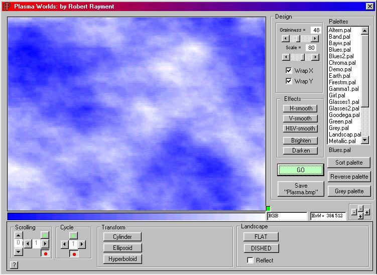



## Plasma Worlds\(addition\)

### Description

Plasma Worlds by Robert Rayment. (Cylindrical tunnel added to ASM version)Two progs. One, pure VB (no APIs or OCXs) for making plasma screens that can be saved as a bmp, bit slow but adequate when compiled. Plasma uses a non-recursive routine on to any rectangle and can be wrapped for tiling. Graininess, scale & color palettes can be changed. The other prog is the same PLUS scrolling in 16 directions, color cycling, cylindrical, spherical & hyperbolic wrapping and fantasy landscape projections all with multiple controls - VB+APIs+ASM, much faster. Only tested on Win98, should be OK on ME & XP but some Win2K OSs have problems with this use of Assembler. Please let me know your OS if you find bugs. Zip 79KB.
 
### More Info
 
Just run

Pictures

             |
---                |---
**Submitted On**   |2002-06-15 06:28:48
**By**             |[Robert Rayment](https://github.com/Planet-Source-Code/PSCIndex/blob/master/ByAuthor/robert-rayment.md)
**Level**          |Intermediate
**User Rating**    |5.0 (45 globes from 9 users)
**Compatibility**  |VB 6\.0
**Category**       |[Graphics](https://github.com/Planet-Source-Code/PSCIndex/blob/master/ByCategory/graphics__1-46.md)
**World**          |[Visual Basic](https://github.com/Planet-Source-Code/PSCIndex/blob/master/ByWorld/visual-basic.md)
**Archive File**   |[Plasma\_Wor946786152002\.zip](https://github.com/Planet-Source-Code/robert-rayment-plasma-worlds-addition__1-35386/archive/master.zip)

### API Declarations

None in one prog, lots in the other

